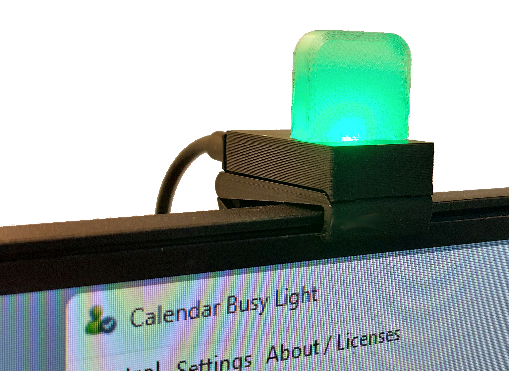
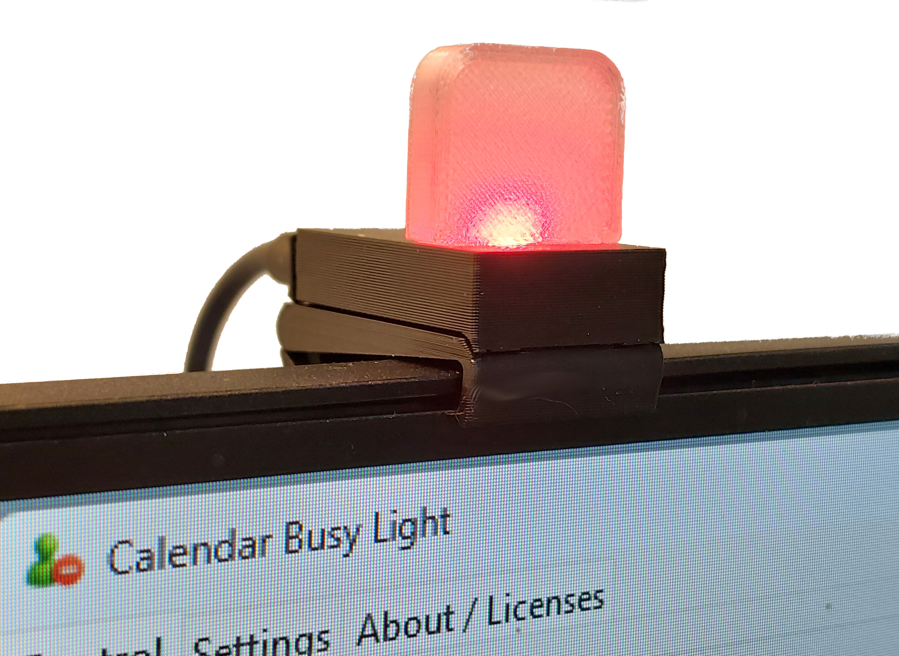

# Busy Light (Outlook → NeoPixel) — Local‑Only Project

Turn your Outlook calendar on Windows into a **busy light** driven by a single **WS2812/NeoPixel** LED over serial.  
Privacy-first: No Azure. No Graph. No Teams. **Local-only**: Outlook COM + Serial.

This repo contains everything: **Python GUI app**, **Arduino firmware**, **electronics notes**, and **3D-printed housing** guidelines.



## Highlights

- **Windows Python GUI** reads your **local Outlook** calendar via COM
- **Arduino NeoPixel** firmware accepts `R G B` commands over serial
- **Heartbeat auto‑off**: light turns off if host goes away (no `PING`)
- **Configurable colors**, brightness, fade, blink, working hours
- **Manual mode** + **Quick test** buttons for instant checks
- **3D-printable housing** STEP files and printing suggestions

> Privacy by design: no cloud tokens, no tenant approval, no Graph calls—just your local Outlook app and a serial cable.

## Repository Structure

```text
.
├─ arduino/
│  ├─ busylight/busylight.ino # firmware for WS2812/NeoPixel
│  └─ README.md                               # Arduino-specific docs
├─ python/
│  ├─ assets/                                 # icons images
│  ├─ calendar_busy_light.py                  # main GUI app
│  └─ README.md                               # Python-specific docs
├─ hardware/
│  └─ README.md                               # (optional) detailed wiring notes
├─ housing/
│  ├─ step/                                   # STEP files
│  │  ├─ Light_Guide.step
│  │  ├─ Mounting_bracket.step
│  │  ├─ PCB_case_usb_c.step
│  │  ├─ PCB_case_back_c.step
│  │  ├─ PCB_case_micro_usb.step
│  │  └─ PCB_case_back_micro_usb.step
│  └─ README.md                               # printer settings & assembly
├─ images/
├─ LICENSE.md
└─ README.md                                  # ← this file
```

## System Overview

```text
Outlook (Windows) ──COM──► Python GUI ──Serial(115200)──► Arduino ──► NeoPixel LED
                                 ▲             │
                                 └── Heartbeat ┘  (PING/PONG; auto‑off on timeout)
```

### Status Mapping (default)

| Calendar status                  | LED behavior (configurable) |
| -------------------------------- | --------------------------- |
| **Busy / Tentative**             | Red                         |
| **Upcoming Busy** (N min before) | Blinking orange             |
| **OOF**                          | Off                         |
| **Free / Working Elsewhere**     | Green                       |

Everything is configurable in the GUI and saved to JSON.

## Electronics

The electronics are based on a **Pro Micro — 5 V / 16 MHz board** with a single **WS2812B** addressable RGB LED mounted on the back.

- 1× **Pro Micro — 5 V / 16 MHz** (ATmega32U4)
- 1× **WS2812B** addressable RGB LED (single LED)
- 1 × USB-C or Micro-USB cable (depending on the USB connector type of the selected Pro Micro board)

> See [**./hardware/README.md**](./hardware/README.md) for full details.

## Arduino Firmware

- File: [./arduino/busylight/busylight.ino](./arduino/busylight/busylight.ino)
- Library: **Adafruit NeoPixel** (via Library Manager)
- Baud: **115200**

### Supported Commands

- Color: `255 0 0` / `RGB 0 255 0` / `#FF8000`
- Utility: `OFF`, `TEST`
- Heartbeat: `PING` → replies `PONG`
- Watchdog config: `HBEN 0/1`, `HBTO <ms>`, `HBRST`, `STAT?`

On boot, the LED briefly blinks gray to show the firmware is running.  
If **no `PING`** is received for the configured timeout, the LED turns **off** automatically.

> See [**./arduino/README.md**](./arduino/README.md) for full details.

## Python GUI App

- File: [./python/calendar_busy_light.py](./python/calendar_busy_light.py)
- Requires: `pywin32`, `pyserial`

  ```bash
  pip install pywin32 pyserial
  ```

- Run:

  ```bash
  pythonw.exe python/calendar_busy_light.py
  ```

> See [**./windows_startup_python_guide.md**](./windows_startup_python_guide.md) for details on how to configure Windows 11 to automatically run a the Python application at startup.

### Key Features

- **Auto/Manual** mode toggle
- **Color scheme** pickers (Busy, Upcoming, Free, OOF, Unknown)
- **Brightness** (0–100%), **Fade** (ms)
- **Upcoming window** (min), **Past grace** (min)
- **Ignore subjects** (e.g., `lunch; focus; reminder`)
- **Working hours** + out‑of‑hours status behavior
- **Progress bar** and **countdown** to start/end
- **Heartbeat & ACK** (enable, interval, expect ACK, timeout)
- **Serial auto‑reconnect** and **Quick test** buttons
- **JSON settings** persisted (no registry edits)

> See [**./python/README.md**](./python/README.md) for full details.

## Housing (3D‑Printed)

The STEP files are located in the 'housing/step/' directory:

- Light_Guide.step - Translucent cap above the NeoPixel
- Mounting_bracket.step - Monitor mounting bracket
- PCB_case.step - Enclosure for the Pro Micro board with the single LED
- PCB_case_back.step - Back cover of the enclosure with slots for the USB connector

> See [**./housing/README.md**](./housing/README.md) for full details.



### Assembly Tips

1. Attach the LED to the back of the main PCB.
2. Route the D4, GND, and 5V wires to the LED PCB, keeping the wires as short as possible.
3. Slide the PCB into the **PCB case** with the LED facing the light opening.
4. Press-fit the **PCB case back** (back cover) over the USB plug.
5. Slide the PCB case assembly onto the mounting bracket.
6. Press-fit the **Light Guide** (diffuser) on top of the enclosure.
7. Plug in the USB cable and verify operation using the Python **Quick Test**.

See [**./hardware/README.md**](./hardware/README.md) and [**./housing/README.md**](./housing/README.md) for full details.

## Quick Start (End‑to‑End)

1. **Flash Arduino** with `NeoPixelBusyLight.ino` and verify via Serial Monitor:
   - `TEST` cycles colors, `PING` → `PONG`.
2. **Run Python app**, pick your **COM port** in *Settings → Serial*, and **Save settings**.
3. Click **Manual → Free** to verify LEDs.
4. Switch to **Auto**: your Outlook calendar should now drive the light.

## Troubleshooting

- **No light but PONG works**:
  - Check **Brightness > 0%**, **Color scheme** for current state, and **Out‑of‑hours** behavior.
- **No serial**: ensure only one app owns the COM port (close Serial Monitor).
- **Blink looks dim**: reduce **Fade** (ms) or set to **0** for hard edges.
- **Turns off randomly**: heartbeat watchdog timed out—either increase `HBTO` (firmware) or ensure the Python heartbeat interval is smaller than the timeout.

## License

This project is released as open-source software under the [MIT License](../LICENSE.md), Copyright (c) 2025 Allan Juhl Kristensen

The software is provided “as is,” without any express or implied warranty.

## Credits

- Adafruit NeoPixel library
- `pywin32`, `pyserial`

Happy making! 🎉
