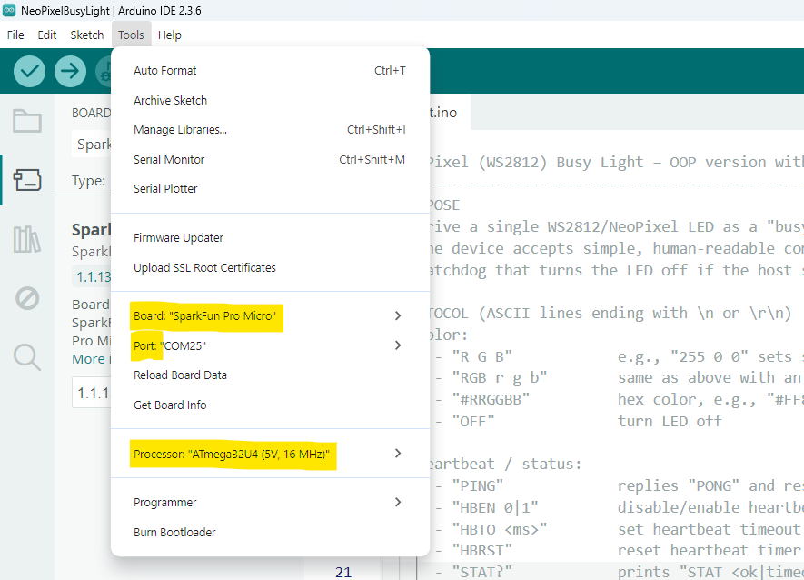

# NeoPixel Busy Light (Serial + Heartbeat Auto-Off)

A tiny Arduino firmware that turns a single **WS2812 / NeoPixel** LED into a presence/busy indicator controllable over **serial**.

- Accepts simple commands like `255 0 0`, `RGB 0 255 0`, `#FF8000`, `OFF`, `TEST`.
- Responds to `PING` with `PONG` (for host health checks).
- **Auto-off** if no heartbeat (`PING`) is received for a configurable timeout.

> ⚠️ Note: Some call these LEDs “WLED”, but this sketch is for **WS2812/NeoPixel** hardware using the **Adafruit NeoPixel** library—not the WLED firmware project.

## Features

- Simple serial protocol (human-readable).
- Heartbeat watchdog: turns LED off if host disappears.
- Built-in test pattern.
- Works with any board supported by Adafruit NeoPixel (Uno, Nano, Leonardo, etc.).
- Pairs nicely with a Python GUI / status app (e.g., calendar/Teams presence).

## Hardware

For information on the Hardware see: [../hardware/README.md](../hardware/README.md)

## Getting Started (one-time setup)

1. **Install Arduino IDE** (latest).
2. **Install library**: *Tools → Manage Libraries…* → search **“Adafruit NeoPixel”** → Install.
3. Go to **File → Preferences**
4. In “**Additional Boards Manager URLs**”, add this URL (add a comma if others already exist):

   ```txt
   https://raw.githubusercontent.com/sparkfun/Arduino_Boards/master/IDE_Board_Manager/package_sparkfun_index.json
   ```

5. Click OK
6. Go to Tools → Board → Boards Manager…
7. Search for “SparkFun AVR Boards”
8. Click Install

## Select the correct board every time

1. Plug the board into USB
2. In Arduino IDE, select:
   - **Tools → Board → SparkFun AVR Boards → SparkFun Pro Micro**
   - **Tools → Processor → ATmega32U4 (5V, 16MHz)** 
   - **Tools → Port** → select the COM port that appears when you plug in the board

   > ⚠️ **Important:** Never change **Processor** to 3.3V/8MHz for these boards – that’s what breaks USB.

   

3. **Open** the sketch (`busylight.ino`) in Arduino IDE.
4. (Optional) Edit these lines if needed:

   ```cpp
   #define LED_PIN    4        // data pin to your NeoPixel
   #define NUM_LEDS   1        // number of LEDs in your strip
   #define BAUD       115200   // must match your host app
   // Heartbeat defaults:
   #define HB_DEFAULT_ENABLED     1
   #define HB_DEFAULT_TIMEOUT_MS  25000UL
   ```

5. Click Upload (the right-arrow button)
6. Wait for “Done uploading.” at the bottom
7. Open **Serial Monitor** @ **115200** and try:
   - `TEST` → cycles colors  
   - `255 255 255` → white  
   - `PING` → prints `PONG`

## Serial Protocol

| Command     | Description                                  | Example         | Response            |
|-------------|----------------------------------------------|-----------------|---------------------|
| `R G B`     | Set color (0–255 per channel)                | `255 0 0`       | –                   |
| `RGB r g b` | Same as above with `RGB` prefix              | `RGB 0 255 0`   | –                   |
| `#RRGGBB`   | Hex color                                    | `#FF8000`       | –                   |
| `OFF`       | Turn LED off                                 | `OFF`           | –                   |
| `TEST`      | Cycle R→G→B→White→Off                        | `TEST`          | –                   |
| `PING`      | Heartbeat ping                               | `PING`          | `PONG`              |
| `HBEN 0/1`  | Disable/enable heartbeat watchdog            | `HBEN 1`        | `HBEN=1`            |
| `HBTO <ms>` | Set heartbeat timeout (milliseconds)         | `HBTO 25000`    | `HBTO=25000`        |
| `HBRST`     | Reset heartbeat timer                        | `HBRST`         | `HBRST=OK`          |
| `STAT?`     | Report status & current RGB                  | `STAT?`         | `STAT ok RGB 0 0 0` |

**Behavior:**  
If `HBEN` is on (default) and **no `PING`** arrives within `HBTO` ms, the LED is **forced OFF** until a new `PING` (or color command) is received.

## Example Sessions

**Manual testing in Serial Monitor:**

```txt
> TEST
> 255 0 0
> 0 255 0
> #0000FF
> OFF
> PING
PONG
> STAT?
STAT ok RGB 0 0 0
```

**Host heartbeat rhythm**  
If your host sends `PING` every 10 s, set timeout to something like 25 s:

```txt
> HBTO 25000
HBTO=25000
> HBEN 1
HBEN=1
```

## Integrating with a Host App

- Open the COM port at **115200** baud.
- Send color lines as ASCII with a trailing newline, e.g.:

```txt
  "255 128 0\n"
  "PING\n"
```

- If you enable ACK checking in the host, read lines and look for **`PONG`**.
- Keep your heartbeat **interval < timeout** (e.g., interval 10 s, timeout 25 s).

---

## Troubleshooting

- **No light at all**
  - Verify 5V/GND, data pin, and that the **NeoPixel library** is installed.
  - Try `TEST` in Serial Monitor.
  - Some boards need a brief delay after `strip.begin()` (already included).

- **Random flicker / wrong colors**
  - Ensure **GND is shared**.
  - Prefer short wires; for long runs use a **level shifter** and series resistor on data.

- **Turns off unexpectedly**
  - Heartbeat watchdog is active; either increase `HBTO` or make sure your host sends `PING` periodically, or `HBEN 0` to disable.

- **Host can’t open COM port**
  - Close Serial Monitor and any other app using the port. Only one process can own it.

## Performance Notes

- This sketch updates **one LED** instantly; for many LEDs, you can raise `NUM_LEDS`.
- The watchdog only blanks the LEDs; it doesn’t reset the MCU.

## License

[MIT License](./../LICENSE.md), Copyright (c) 2025 Allan Juhl Kristensen

## Acknowledgements

- [Adafruit NeoPixel](https://github.com/adafruit/Adafruit_NeoPixel)
