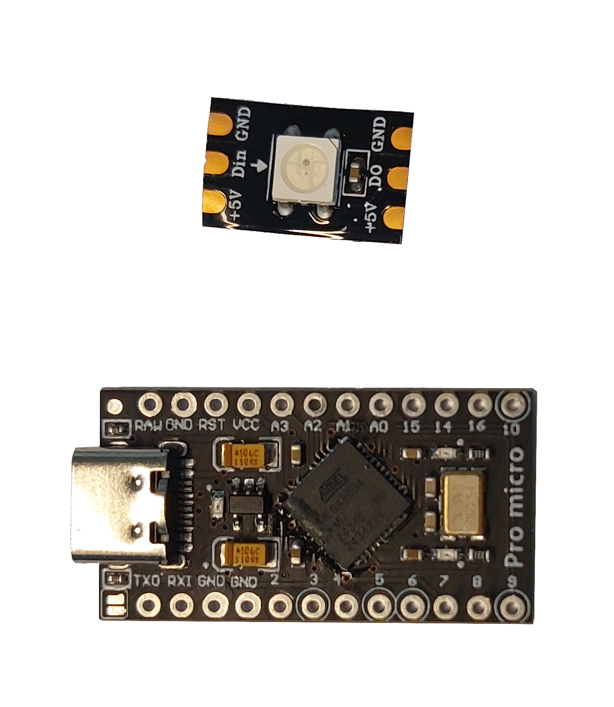
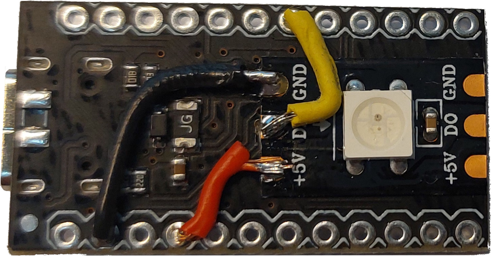

# Busy Light Electronics

The Busy Light hardware is based on a **Pro Micro (ATmega32U4)**. The USB transceiver is integrated into the ATmega32U4, so the board provides native USB connectivity without the need for external interface components. The Pro Micro is available in both 3.3 V and 5 V variants; for this project, the **5 V / 16 MHz** version must be used.

Please note that many Pro Micro clones are available on the market. Ensure that the selected board matches the required enclosure dimensions of about **36 × 18 mm**.

## Electronics

### Bill of Materials (BOM)

- 1× **Pro Micro — 5 V / 16 MHz** (ATmega32U4)
- 1× **WS2812B** addressable RGB LED (single LED)
- 1 × USB-C or Micro-USB cable (depending on the USB connector type of the selected Pro Micro board)



### Wiring (single LED)

```text
Pro Micro 5V  ──► WS2812B LED 5V
Pro Micro GND ──► WS2812B LED GND
Pro Micro D4  ──► WS2812B LED DIN
```

- Make sure the Pro Micro D4 gos to WS2812B LED **DIN** and not to WS2812B LED **DO**.
- Keep **GND common** between the Pro Micro and the LED.
- Data pin default in the firmware is **D4**; you can change it in the sketch if needed.
- With **~15 mm** data wire and **one LED**, direct wiring is fine.
- A single WS2812 at full white draws **≤60 mA** - USB can easily supply that.



## Firmware Notes (Arduino)

For information on the Firmware see: [../arduino/README.md](../arduino/README.md)

## Reference & Datasheets

- [Pro Micro pinout](https://salt.tikicdn.com/ts/product/43/26/b9/10e6217f0be0510c92a05691e59fac0f.png)
- [ATmega32U4 datasheet](https://ww1.microchip.com/downloads/en/DeviceDoc/Atmel-7766-8-bit-AVR-ATmega16U4-32U4_Datasheet.pdf)
- [Pro Micro Schematic](https://cdn.sparkfun.com/datasheets/Dev/Arduino/Boards/Pro_Micro_v13b.pdf)

## License Information

This project is released as open-source software under the [MIT License](../LICENSE.md), Copyright (c) 2025 Allan Juhl Kristensen

The software is provided “as is,” without any express or implied warranty.
