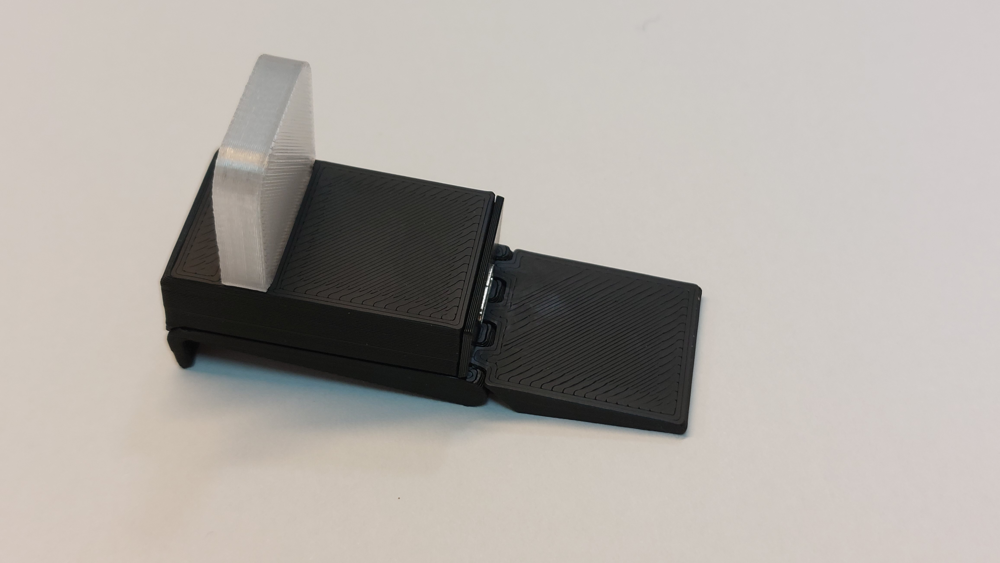
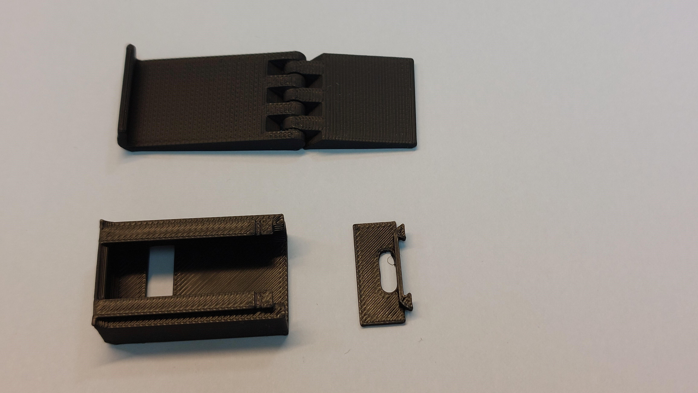
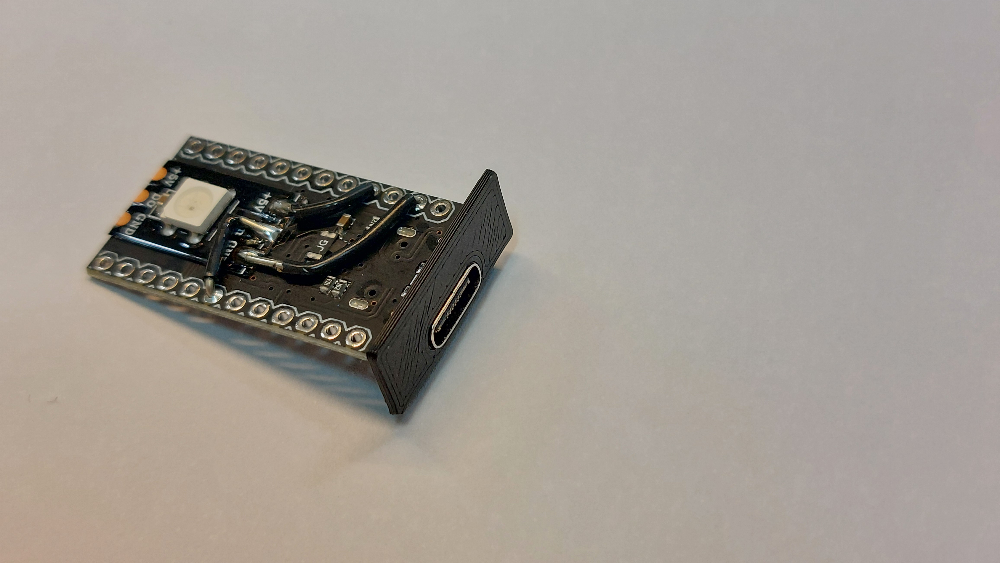
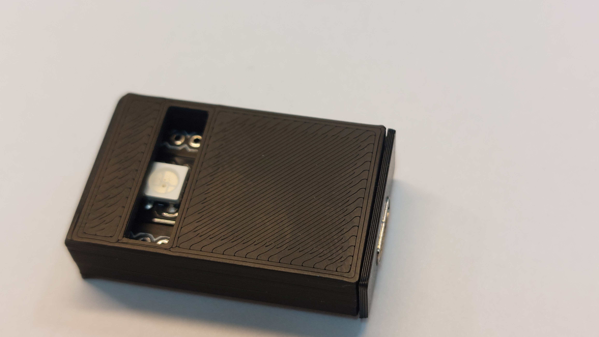
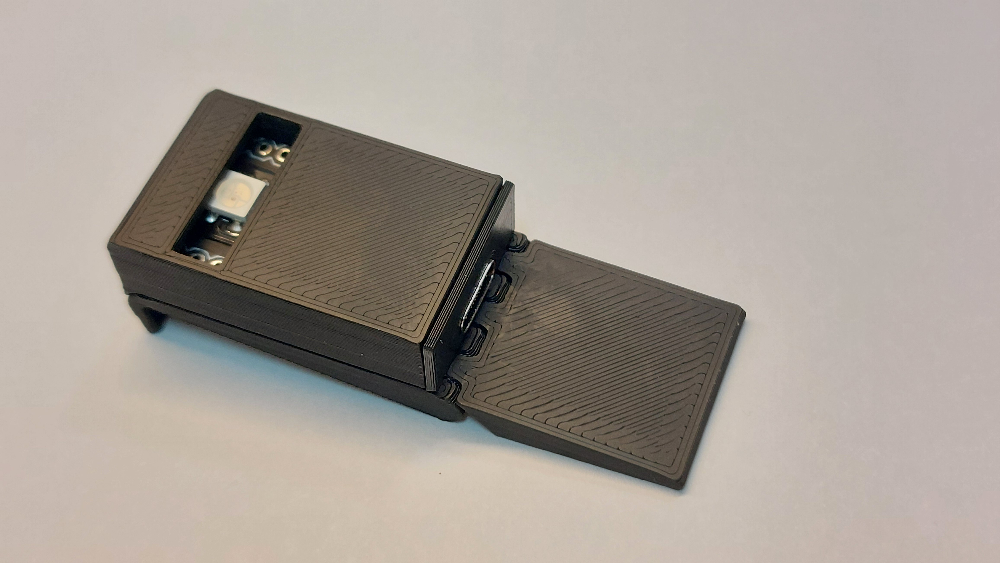

# BusyLight – 3D Printed Enclosure & Assembly Guide

This README describes how to 3D print and assemble the BusyLight enclosure, including recommended printer settings and step-by-step assembly instructions.

## Printed Parts

You will need to print the following parts:

- [**Mounting Bracket**](./step/Mounting_bracket.step)
- [**Light Guide**](./step/Light_Guide.step)
- [**PCB Case**](./step/PCB_case_micro_usb.step)
- [**PCB Case Back**](./step/PCB_case_back_micro_usb.step)
- [**PCB Case**](./step/PCB_case_usb_c.step)
- [**PCB Case Back**](./step/PCB_case_back_usb_c.step)

## Printer Settings

### General Settings (All Parts Except Light Guide)

Use your slicer’s **standard / default profile** for all parts except the Light Guide. For example:

- **Layer height:** ~0.20 mm
- **Perimeters (walls):** 2–3  
- **Infill:** 15–25%  
- **Top / bottom layers:** 3–5  

Adjust if needed based on your printer and filament.

### Special Settings for the Light Guide (Diffuser)

For best light diffusion use Translucent filament:

- **Part:** `Light Guide`  
- **Infill:** **100%**  
- All other settings can follow your standard profile.

## Required Hardware

- 1 × **BusyLight PCB** (with LED and USB plug)
- 1 × **PCB Case** (3D printed)
- 1 × **PCB Case Back** / back cover (3D printed)
- 1 × **Mounting Bracket** (3D printed)
- 1 × **Light Guide** / diffuser (3D printed)

No screws or glue are required; all parts are designed as **press-fit**.

## Assembly Instructions

Follow these steps after printing and cleaning up all parts (remove any stringing or support material):

### 1. Attach the PCB Case Back

Press-fit the **PCB Case Back** (back cover) onto the **PCB Case**, guiding it over the **USB plug** so that the plug exits through the opening.

### 2. Insert the PCB into the PCB Case

Slide the **PCB** into the **PCB Case** with the **LED facing the light opening** in the case.

### 3. Mount the PCB Assembly onto the Bracket

Slide the **assembled PCB Case** (with back cover installed) onto the **Mounting Bracket** until it clicks or feels firmly seated.

### 4. Install the Light Guide (Diffuser)

Press-fit the **Light Guide** on top of the enclosure, over the LED opening, until it sits flush and secure.

